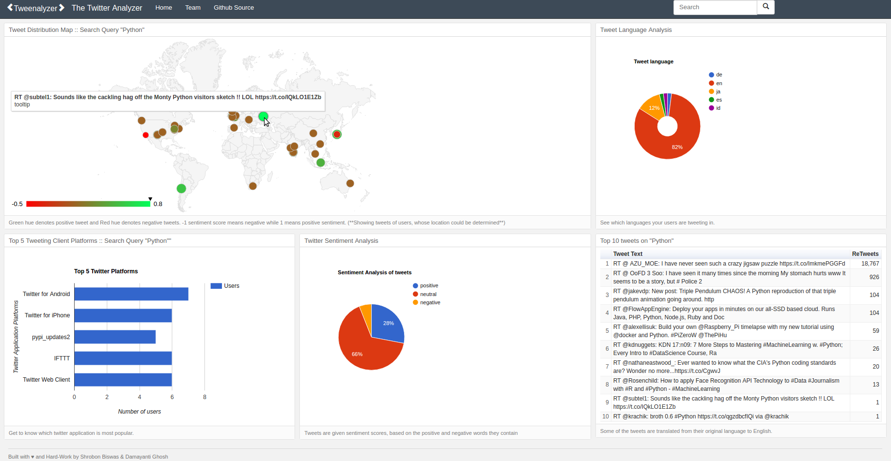

# Tweenalyzer - The Twitter Analyzer
Tweenalyzer helps you analyze your twitter fanbase by providing a visually pleasing data-centric summary on different aspects of your target audience.
- Twitter REST API was used to fetch the tweets based on the user provided query.
- A web interface using Python-Flask Framework was built to show graphical plots on a dashboard.
- Data analysis was performed using scikit-learn and pandas library.
- Google charts was used plotting the graphs on the web dashboard.

Project Tweenalyzer was completed as a part of the MSc in computing Science course MM802 (Multimedia Networking and Communication at University of Alberta).

# Demo [http://tweenalyzer.herokuapp.com/]
Search Query was "Python"



Want to see more interesting tweets and sentiments ? try searching for "Trump" ;)

# Area of Work
- Data Mining / Data Visualization

# Technologies Used
1. Flask    - backend
2. Keen.io  - for dashboard structure
3. Tweepy   - A python wrapper for the Twitter API
4. TextBlob - A wrapper around NLTK, used for sentiment analysis and tweet language translation.
5. Google Charts- for graphing
6. Google Maps - for reverse Geocoding
7. Pandas   - for data manipulation and cleaning

# Installation Instructions:
1. Obtain twitter API keys from https://apps.twitter.com/
2. Plugin your API keys inside configurations.py
3. cd inside the project folder and type the following in your terminal
```
python app.py
```
4. open your browser and type 127.0.0.1:5000
5. Wait for a while . This usually takes some time, since the twitter API has a rate-limitting to search for tweets.

** Note: ** The default tweet search query is "python" . Once the page loads, you have the option of searching tweets of your choice using the searchbar.


# Dependencies
The dependencies are contained in the file requirements.txt

- appdirs==1.4.2
- click==6.7
- cycler==0.10.0
- Flask==0.12
- functools32==3.2.3.post2
- googlemaps==2.4.6
- gunicorn==19.6.0
- itsdangerous==0.24
- Jinja2==2.9.5
- MarkupSafe==0.23
- matplotlib==2.0.0
- nltk==3.2.2
- numpy==1.12.0
- oauthlib==2.0.1
- packaging==16.8
- pandas==0.19.2
- pyparsing==2.1.10
- python-dateutil==2.6.0
- pytz==2016.10
- requests==2.11.1
- requests-oauthlib==0.8.0
- six==1.10.0
- subprocess32==3.2.7
- textblob==0.12.0
- tweepy==3.5.0
- Werkzeug==0.11.15


### Team members:
1. Shrobon Biswas
2. Damayanti Ghosh
